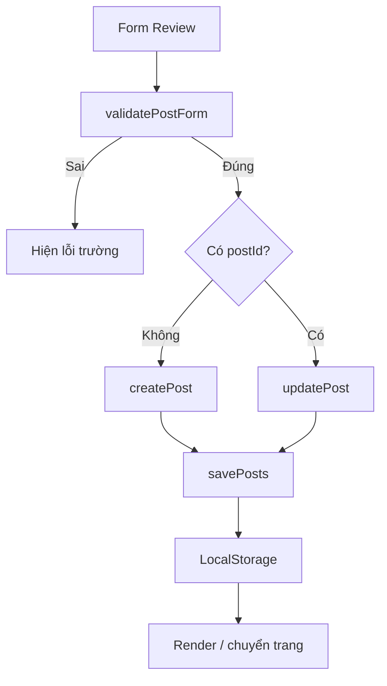
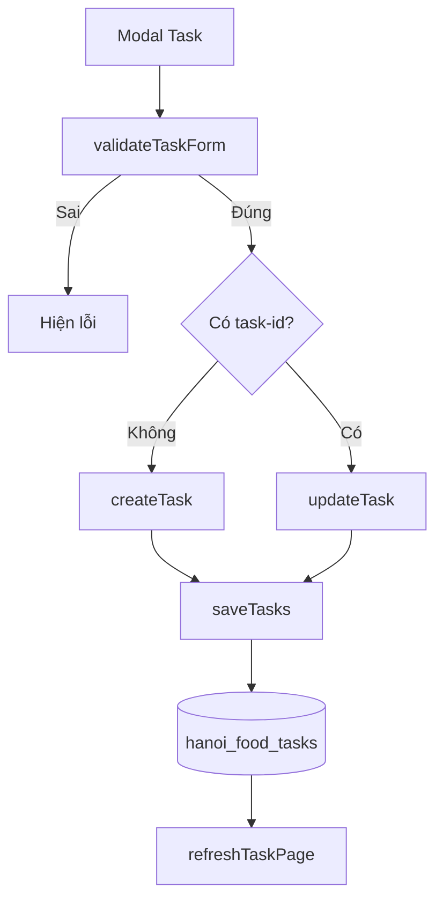

# Luồng CRUD

## Review

| Thao tác | Function chính | File | Luồng |
|---|---|---|---|
| Create | `collectPostFormData`, `validatePostForm`, `createPost` | `posts.js`, `validation.js` | Form → validation → tạo ID/tác giả/thời gian → `savePosts` → chuyển trang My Posts. |
| Read | `getPosts`, `getPostById`, `renderPosts`, `renderPostDetail` | `posts.js` | `getData(POSTS)` → chọn dữ liệu → tạo HTML an toàn → render DOM. |
| Update | `updatePost`, `initializeEditPostPage` | `posts.js` | Đọc ID URL → kiểm tra owner → điền form → validation → giữ likes/save/createdAt → lưu. |
| Delete | `deletePost` | `posts.js` | Kiểm tra đăng nhập và owner → confirm → xóa post, comment và saved ID liên quan → render lại. |

## Task

| Thao tác | Function chính | File | Luồng |
|---|---|---|---|
| Create | `handleTaskSubmit`, `createTask` | `tasks.js`, `validation.js` | Modal form → validation → sinh ID → mặc định Pending → lưu và refresh. |
| Read | `getTasks`, `renderTasks` | `tasks.js` | Đọc mảng → search/filter/sort trên bản sao → tạo card → cập nhật thống kê. |
| Update | `openTaskModal`, `updateTask`, `toggleTaskStatus` | `tasks.js` | Điền modal hoặc toggle → cập nhật đúng ID → lưu → refresh. |
| Delete | `deleteTask`, `scheduleTaskUndo` | `tasks.js` | Confirm → xóa → toast Undo giữ snapshot tạm → có thể chèn lại và lưu. |

