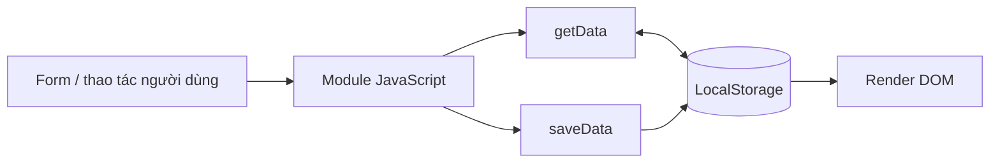

# Thiết kế LocalStorage

Mọi thao tác đi qua `getData`, `saveData`, `removeData` trong `assets/js/storage.js`. Dữ liệu được `JSON.stringify` khi ghi và `JSON.parse` khi đọc.

| Key | Kiểu | Nội dung |
|---|---|---|
| `hanoi_food_users` | `User[]` | Tài khoản đăng ký và tài khoản seed. |
| `hanoi_food_current_user` | `SessionUser \| null` | Phiên hiện tại, không chứa password. |
| `hanoi_food_posts` | `Post[]` | Các bài review. |
| `hanoi_food_comments` | `Comment[]` | Bình luận gắn với review. |
| `hanoi_food_tasks` | `Task[]` | Kế hoạch đi quán. |
| `hanoi_food_saved_posts` | `number[]` | ID các bài đã lưu. |
| `hanoi_food_theme` | `string` | Theme; seed hiện tại là `light`. |

## User

`id`, `fullname`, `username`, `email`, `password`, `avatar`, `bio`, `joinedAt`. Password dạng rõ chỉ phục vụ bài tập front-end. `SessionUser` sao chép trường công khai và loại `password`.

## Post

`id`, `userId`, `authorName`, `authorAvatar`, `title`, `restaurantName`, `category`, `district`, `address`, `rating`, `content`, `image`, `hashtags[]`, `likes`, `likedByCurrentUser`, `isSaved`, `createdAt`, `updatedAt`.

## Comment

`id`, `postId`, `userId`, `authorName`, `authorAvatar`, `content`, `createdAt`.

## Task

`id`, `title`, `description`, `deadline`, `priority` (`Low|Medium|High`), `status` (`Pending|Done`), `category` (`Cafe|Food`), `district`, `createdAt`, và `updatedAt` sau khi sửa.

## Seed và an toàn dữ liệu

`seedInitialData()` chỉ tạo key khi key chưa tồn tại, vì vậy mảng rỗng không bị seed lại. Hàm cũng bổ sung `joinedAt`, sửa đường dẫn ảnh seed cũ và loại password khỏi session cũ. `generateId()` lấy ID lớn nhất cộng một. Khi JSON lỗi hoặc storage không đọc được, `getData()` trả về giá trị mặc định.

