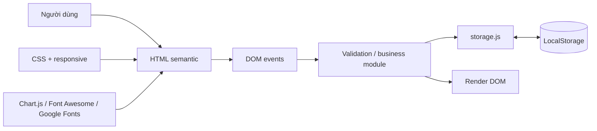
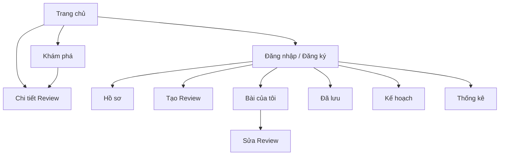
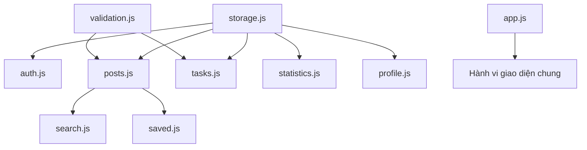

# Luồng hệ thống

## Kiến trúc tổng quát

## Login

Người dùng → form login → chuẩn hóa username/email → tìm user → so sánh password → tạo session không password → lưu `hanoi_food_current_user` → cập nhật UI hoặc redirect an toàn.

## Review

Người dùng → form review → validation → `createPost`/`updatePost` → `hanoi_food_posts` → `renderPosts`, `renderMyPosts` hoặc `renderPostDetail`.

## Task

Người dùng → modal Task → validation → hàm CRUD → `hanoi_food_tasks` → search/filter/sort → `renderTasks` và thống kê nhanh.

## Statistics

Các key LocalStorage → `getStatisticsData` → hàm `count...` → cấu hình dataset → `createChart` → Chart.js render canvas. Trước khi render lại, chart cũ được destroy để tránh trùng instance.

## Sitemap và navigation

## Cấu trúc module

