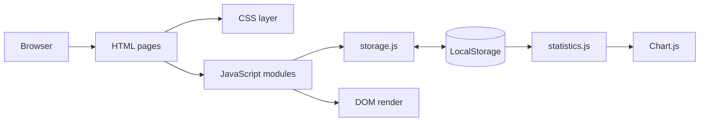

# 03. Kiến trúc hệ thống

## Các lớp logic

1. Presentation: HTML và CSS.
2. Interaction: event listener, form handler và render function.
3. Domain module: Auth, Review, Task, Search, Profile, Statistics.
4. Persistence: `storage.js` và các key LocalStorage.

Kiến trúc hiện tại là multi-page application với script global. Thứ tự nạp script là dependency contract. Xem sơ đồ chi tiết tại [SYSTEM_FLOW.md](../SYSTEM_FLOW.md).

