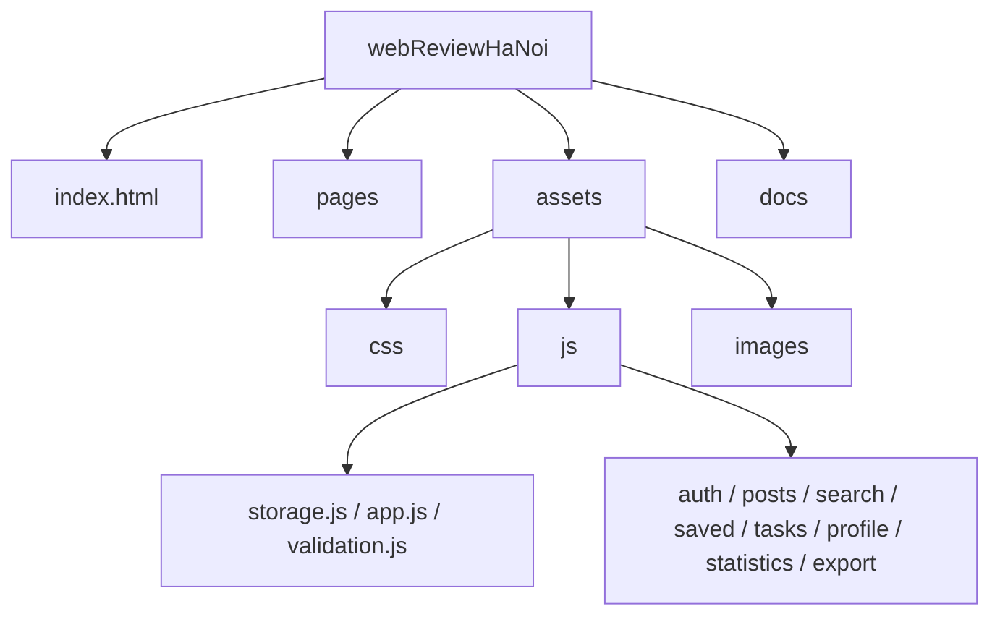

# 04. Cấu trúc project

Source được chia thành trang (`pages/`), tài nguyên runtime (`assets/`) và tài liệu (`docs/`). CSS và JavaScript tiếp tục chia theo module nghiệp vụ.

Danh mục từng file và vai trò được duy trì tại [PROJECT_STRUCTURE.md](../PROJECT_STRUCTURE.md).
