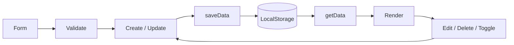

# 06. CRUD

## Review

Create và Update dùng chung form/validation; Read có feed, detail và danh sách cá nhân; Delete kiểm tra owner rồi đồng thời dọn comment và Saved ID liên quan. Dữ liệu được ghi vào `hanoi_food_posts`.

## Task

Create/Update dùng modal; Read kết hợp search/filter/sort; Delete có confirm và cơ chế Undo tạm thời; toggle status là một dạng Update. Dữ liệu được ghi vào `hanoi_food_tasks`.

Function và từng bước cụ thể xem [CRUD_FLOW.md](../CRUD_FLOW.md).

